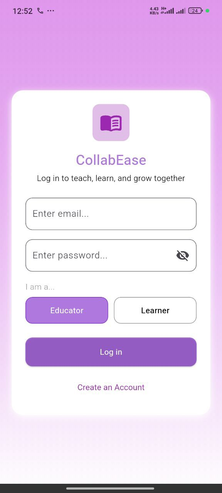
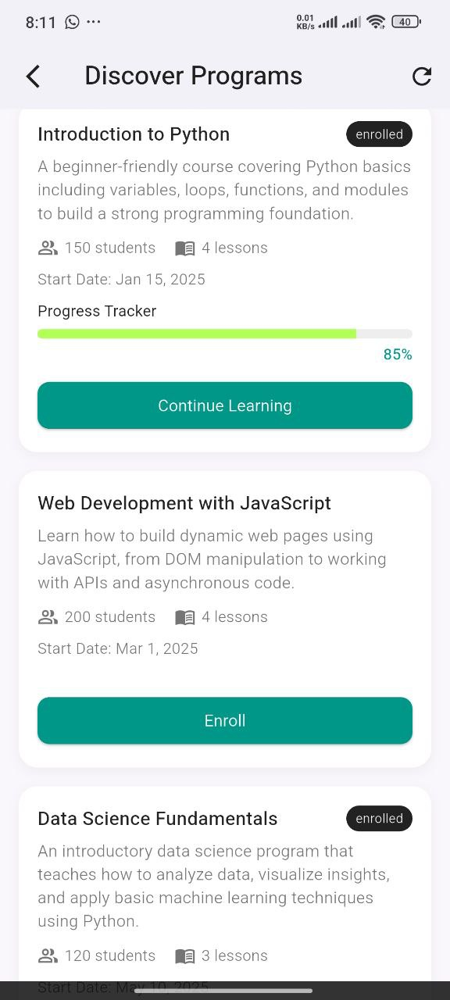
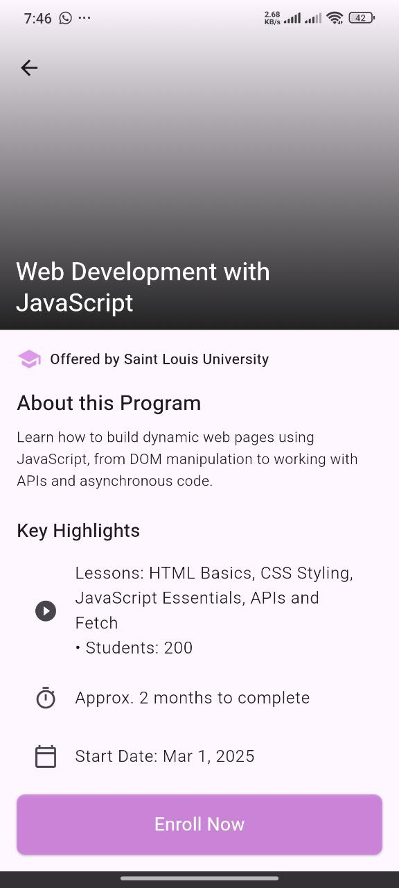
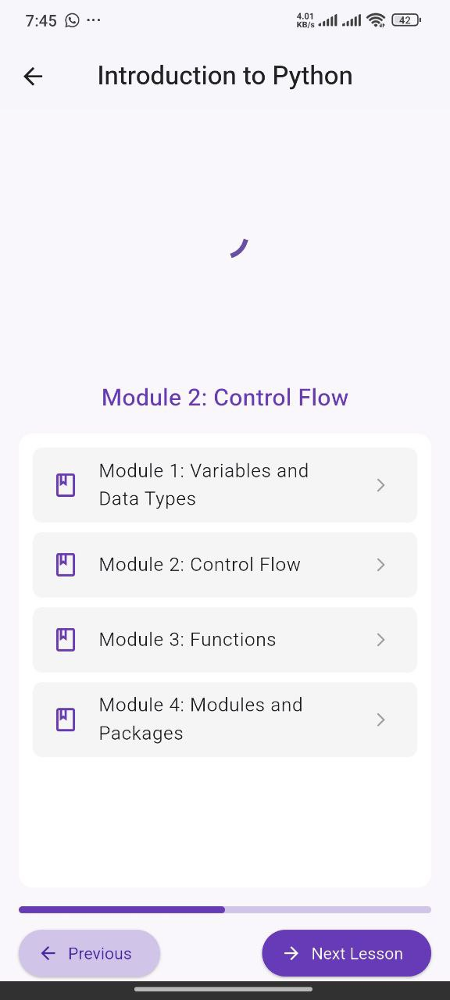
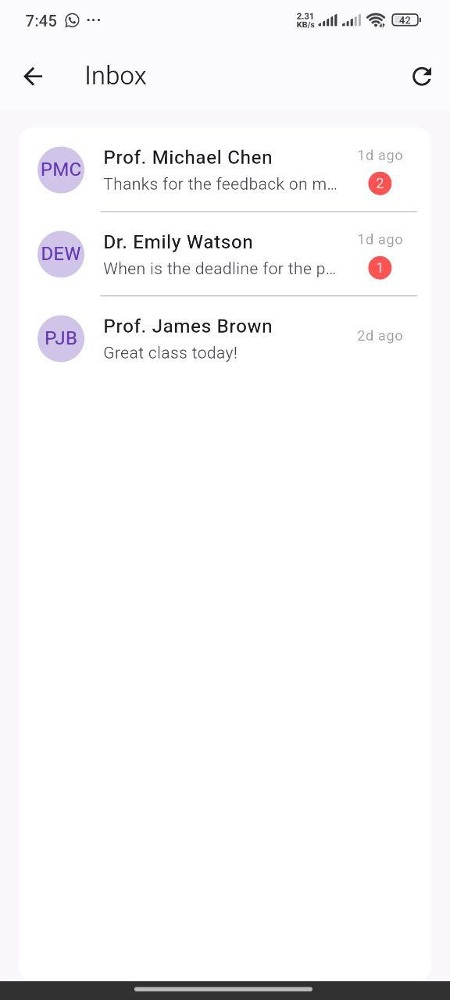
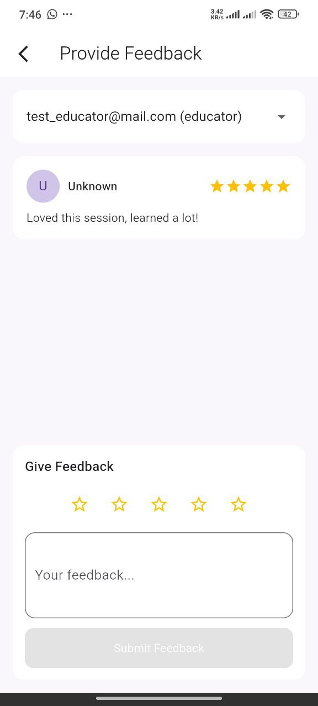

# 📚 CollabEase –  Learning and Management App

## 🌟 Project Vision
**CollabEase** is a mobile platform designed to bridge the communication gap between **learners** and **educators**. Our vision is to create a unified space where both roles can interact effortlessly — sharing announcements, creating and managing tasks, tracking performance, and staying connected through an intuitive and responsive interface.  

We aim to empower learners with clear visibility of their educational journey, while giving educators the tools to manage, track, and inspire student success effectively.

---

## 🎯 Project Objectives
1. **Enhance Communication**  
   Facilitate seamless communication between learners and educators through direct messaging and announcements.

2. **Simplify Task Management**  
   Allow users to create, assign, and monitor tasks efficiently, reducing confusion and improving productivity.

3. **Enable Progress Tracking**  
   Provide a clear, visual representation of learning or teaching progress through intuitive dashboards.

4. **Support Dual Roles**  
   Design the app to adapt based on whether the user is a *learner* or an *educator*, offering tailored features for each.

5. **Ensure Accessibility & Usability**  
   Deliver a clean, user-friendly mobile interface with smooth navigation, responsive layouts, and customizable themes.

---

## 📱 App Navigation Flow

### **1. Login Screen**
- **Purpose:** Authenticate users and identify their role.  
- **Inputs:**  
  - Username or email  
  - Password  
  - Role selection (Learner / Educator)  
- **Features:**  
  - Option for account verification  
  - Redirect to Home screen upon successful login  

---

### **2. Home Screen**
- **Purpose:** Central hub displaying personalized information.  
- **For Learners:**  
  - View inbox, enrolled programs, tasks, and announcements  
  - Overview cards showing:  
    - Number of active courses  
    - Pending tasks count  
    - Progress percentage  
- **For Educators:**  
  - Similar layout with overview cards showing:  
    - Number of enrolled students  
    - Active courses being taught  
    - Average student completion rate  

---

### **3. Programs Screen**
- **Purpose:** Display all active or available courses.  
- **Features:**  
  - List of enrolled or taught programs  
  - Progress indicators for each course  
  - Ability to view course details  

---

### **4. Inbox Screen**
- **Purpose:** Enable direct communication between users.  
- **Features:**  
  - Message threads between learners and educators  
  - Notifications for new messages  
  - Clear timestamp and sender identity  

---

### **5. Tasks Screen**
- **Purpose:** Manage and monitor assigned tasks.  
- **Features:**  
  - Learners: View pending/completed tasks and due dates  
  - Educators: Create and assign new tasks  
  - Progress tracking for each task  

---

### **6. Announcements Screen**
- **Purpose:** Broadcast important updates.  
- **Features:**  
  - Educators can post announcements  
  - Learners can view all current and past announcements  
  - Filter or search by course  

---

## ⚙️ Additional Features
- **Theme Customization:** Switch between light and dark modes.  
- **Global Navigation Controls:**  
  - Back button on every page for intuitive navigation  
  - Logout button accessible from all screens  
- **Consistent UI/UX:** Ensures clarity and smooth transitions between screens.

---

## 🧭 App Structure Overview
Login Screen
↓
Home Screen
├── Programs
├── Inbox
├── Tasks
└── Announcements


---
### Login Screen




---
### Home Screen


---


### Programs screen



---


### Enroll program



---

### Learning page



---

### Inbox page



---

### Feedback page



---

## 👥 Target Users
- **Learners:** Track academic performance, tasks, and communication.  
- **Educators:** Manage students, courses, and performance insights.


## 📝 Features (MVP)
- Landing screen
- Alternate Registration/Login for Teachers and Students.
- Course Overview (Home Page) 
- Program Details Screen
- Learning screen
- Create Program (educators)
- enrolled courses screen
- Feedback screen


---

## 🚀 Future Enhancements
- Push notifications for tasks and announcements  
- In-app grading or assessment system  
- Analytics dashboard for educators  
- Multi-language support  

---
  

---

---

## 🚀 Setup Instructions

### Prerequisites
Before you begin, ensure you have the following installed:
- **Flutter SDK** (version 3.8.1 or higher)
- **Dart SDK** (comes with Flutter)
- **Android Studio** or **VS Code** with Flutter extensions
- **Firebase Account** (for authentication)
- **Git** (for version control)

### Installation Steps

1. **Clone the Repository**
   ```bash
   git clone https://github.com/your-username/Excelerate_MAD-Flutter-_GROUP_04_Oct-Nov_2025.git
   cd Excelerate_MAD-Flutter-_GROUP_04_Oct-Nov_2025
   ```

2. **Install Dependencies**
   ```bash
   flutter pub get
   ```

3. **Firebase Setup**
   - Create a Firebase project at [Firebase Console](https://console.firebase.google.com/)
   - Add your app to the Firebase project
   - Download `google-services.json` (Android) and `GoogleService-Info.plist` (iOS)
   - Place them in the appropriate directories:
     - Android: `android/app/google-services.json`
     - iOS: `ios/Runner/GoogleService-Info.plist`
   - Update `lib/firebase_options.dart` with your Firebase configuration

4. **Run the App**
   ```bash
   # For Android
   flutter run
   
   # For iOS (macOS only)
   flutter run -d ios
   
   # For a specific device
   flutter devices  # List available devices
   flutter run -d <device-id>
   ```

5. **Build for Production**
   ```bash
   # Android APK
   flutter build apk --release
   
   # iOS (macOS only)
   flutter build ios --release
   ```

### Running the App Locally
1. Ensure you have an emulator/simulator running or a physical device connected
2. Run `flutter pub get` to install all dependencies
3. Run `flutter run` to launch the app
4. The app will start on the Login screen by default

### Troubleshooting
- **Firebase Authentication Issues**: Ensure Firebase is properly configured and `firebase_options.dart` is generated
- **Dependencies Issues**: Run `flutter clean` and then `flutter pub get`
- **Build Errors**: Ensure your Flutter SDK is up to date: `flutter upgrade`

---

## 📸 Screenshots

The app includes the following key screens:

### Login Screen
Users can log in with their email and password, selecting their role (Learner or Educator).


### Home Dashboard
Personalized dashboard showing overview cards for Inbox, Programs, Tasks, and Announcements.


### Program Listing
Browse and explore available learning programs with progress tracking.


### Program Details
Detailed view of each program including curriculum, instructor information, and enrollment options.


### Enrolled Courses
View all enrolled courses with progress indicators and access learning materials.


### Feedback Screen
Submit and view feedback for educators and learners.


---

## 📝 Changelog

See [CHANGELOG.md](CHANGELOG.md) for a detailed history of changes, features, and improvements.

### Recent Updates (Week 4)
- ✅ Complete navigation system with GoRouter
- ✅ Firebase authentication integration
- ✅ Program listing and details screens
- ✅ Feedback form with submission functionality
- ✅ Enrolled courses page with progress tracking
- ✅ Consistent UI/UX with branded theme
- ✅ Data integration with JSONPlaceholder API

---

## 🤝 Contribution Log

### Week 1: Project Setup & Initial Design
- Project initialization
- UI/UX design planning
- Navigation structure setup

### Week 2: Core Features Implementation
- Login and Signup screens
- Firebase authentication setup
- Home dashboard implementation

### Week 3: Data Integration & Navigation
- Program listing with API integration
- Program details screen
- Navigation flow completion

### Week 4: Finalization & Polish
- Feedback form implementation
- Enrolled courses page
- Code refactoring and optimization
- Documentation and README updates

---

## 👥 Team Members
**Group 04 - Excelerate MAD Flutter Project**
- Developed during Oct-Nov 2025 internship program

---

## 📄 License
This project is licensed under the [MIT License](LICENSE).

---

## 📞 Support
For issues or questions, please open an issue on the GitHub repository.

---


